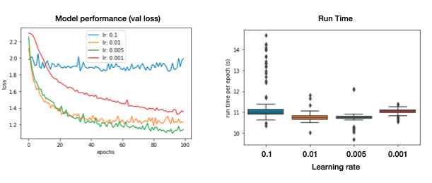
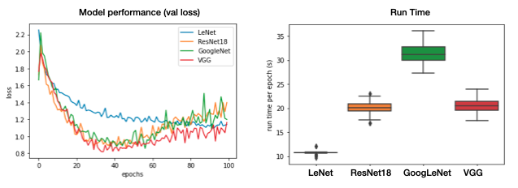
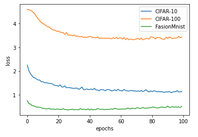
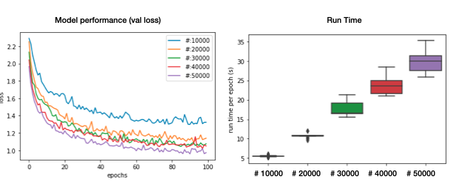

```null
Course project of CSE463 Machine Learning, UNIST
```

## Image Classification for CIFAR-10, CIFAR-100

### Platform

This code was implemented and tested with below environment

```
python == 3.6.12
torch == 1.9.0
torchvision == 0.10.0
```

### Training

```
# ************************** CIFAR-10 *****************************
$ python train.py --model lenet --dataset cifar10 --n_train 20000 
$ python train.py --model MLP --dataset cifar10 --n_train 20000 
$ python train.py --model resnet --dataset cifar10 --n_train 20000 
$ python train.py --model vgg --dataset cifar10 --n_train 20000 
$ python train.py --model googlenet --dataset cifar10 --n_train 20000 
# ************************** CIFAR-100 *****************************
$ python train.py --model lenet --dataset cifar100 --n_train 20000 
$ python train.py --model MLP --dataset cifar100 --n_train 20000 
$ python train.py --model resnet --dataset cifar100 --n_train 20000 
$ python train.py --model vgg --dataset cifar100 --n_train 20000 
$ python train.py --model googlenet --dataset cifar100 --n_train 20000 
```

### Performance

- `lr` : 0.005, `epochs`: 100, `batch_size` : 100, `optimizer` : SGD, `n_train` : 20000

|    Dataset    |   Model   | Accuracy |
| :-----------: | :-------: | :------: |
|   CIFAR-10    |    RF     | 42.19 %  |
|   CIFAR-10    |    MLP    |  44.3 %  |
| **CIFAR-10**  | **LeNet** | **64 %** |
|   CIFAR-100   |    RF     |  16.7 %  |
|   CIFAR-100   |    MLP    |  2.45 %  |
| **CIFAR-100** | **LeNet** | **24 %** |

- learning rate
  - `epochs`: 100, `batch_size` : 100, `optimizer` : SGD, `n_train` : 20000

|   Dataset    | Learning Rate | Accuracy |
| :----------: | :-----------: | :------: |
|   CIFAR-10   |      0.1      |   25 %   |
|   CIFAR-10   |     0.01      |   61 %   |
| **CIFAR-10** |   **0.005**   | **64 %** |
|   CIFAR-10   |     0.001     |   55 %   |



- CNN

  - `lr` : 0.005, `epochs`: 100, `batch_size` : 100, `optimizer` : SGD, `n_train` : 20000

  |   Dataset    |   Model   | Accuracy |
  | :----------: | :-------: | :------: |
  |   CIFAR-10   |  LeNet-5  |   64 %   |
  |   CIFAR-10   | GoogLeNet |   74 %   |
  | **CIFAR-10** | **VGG19** | **78 %** |
  |   CIFAR-10   | ResNet18  |   74 %   |



- Dataset

  - `lr` : 0.005, `epochs`: 100, `batch_size` : 100, `optimizer` : SGD, `n_train` : 20000

  |     Dataset      |  Model  | Accuracy |
  | :--------------: | :-----: | :------: |
  |     CIFAR-10     | LeNet-5 |   64 %   |
  |    CIFAR-100     | LeNet-5 |   24 %   |
  | **Fasion MNIST** | LeNet-5 | **85 %** |



- number of training data
  - `lr` : 0.005, `epochs`: 100, `batch_size` : 100, `optimizer` : SGD

| Dataset  |  Model  | # of data | Accuracy |
| :------: | :-----: | :-------: | :------: |
| CIFAR-10 | LeNet-5 |   10000   |   56 %   |
| CIFAR-10 | LeNet-5 |   20000   |   64 %   |
| CIFAR-10 | LeNet-5 |   30000   |   66 %   |
| CIFAR-10 | LeNet-5 |   40000   |   66 %   |
| CIFAR-10 | LeNet-5 |   50000   |   69 %   |


